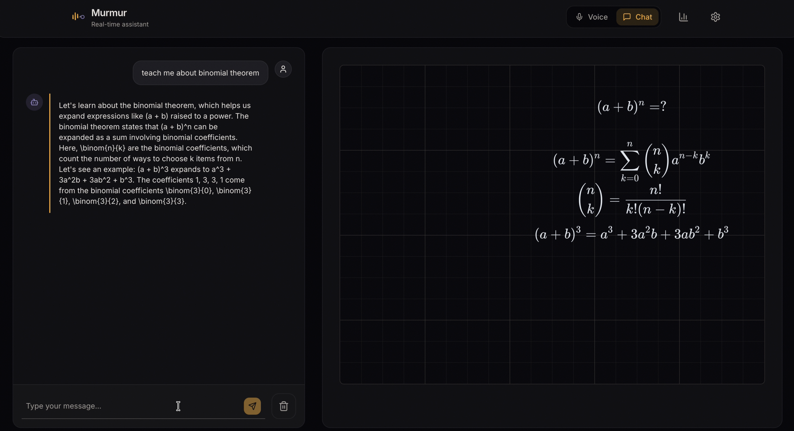

# Murmur

Murmur is a voice-first AI tutor with a synchronized visual canvas. A learner speaks naturally; Murmur transcribes the turn, reasons with an agent's prompt and memory, and delivers speech plus typed canvas events that the browser renders as hand-drawn diagrams.



## What is implemented

- Authenticated agent, resource, session, chat, voice, and observability APIs
- Text chat streamed over Server-Sent Events (SSE)
- WebRTC voice sessions with Deepgram transcription and optional Smart Turn detection
- OpenAI, Groq, and Gemini provider adapters behind one LLM contract
- ElevenLabs speech with bounded retries and optional Kokoro fallback
- Database-backed tools, including web search and canvas updates
- Four-layer memory: short-term context, episodic summaries, Mem0 semantic memory, and an explicit user profile
- A deterministic Scene Description Language (SDL) compiler and a Rough.js/GSAP SVG renderer
- User-scoped logs, latency metrics, session history, and mastery data

## Runtime flow

```text
Browser microphone
  -> WebRTC
  -> Deepgram STT
  -> Smart Turn / endpointing
  -> LLM + memory + tools
  -> sentence-pipelined TTS
  -> WebRTC audio + typed canvas events
  -> SDL compiler -> SVG canvas
```

Text chat enters the same LLM, memory, tool, and canvas layers through SSE instead of WebRTC.

## Repository layout

```text
backend/murmur/
  api/            FastAPI factory, dependencies, schemas, and routers
  agents/         agent prompt construction and runtime helpers
  canvas/         backend canvas state and tool contracts
  chat/           transport-neutral chat service
  core/           configuration and domain errors
  llm/            provider adapters, pipeline, routing, and tool policy
  memory/         context budgeting, durable layers, and orchestration
  persistence/    SQLModel tables, engine lifecycle, and repositories
  resources/      PDF/URL ingestion and retrieval
  runtime/        typed chat/voice session registry and supervision
  tools/          tool contracts, persistence bridge, and execution
  voice/          signaling, STT, turn handling, TTS, and audio utilities
web/src/
  app/            Next.js routes and layouts
  features/canvas typed canvas contracts, normalization, rendering, and timing
  lib/scene-kit/  semantic scene compiler and layout engine
  hooks/          chat and WebRTC client transports
tests/            provider-free backend unit and integration tests
scripts/manual/   opt-in live-provider checks, excluded from pytest
var/              ignored local databases, vector data, and generated output
main.py            compatibility entrypoint for `uvicorn main:app`
```

There is one supported backend import root: `murmur`. The deleted `funcs` package is not a compatibility surface.

## Quick start

Prerequisites: Python 3.11 or 3.12, [uv](https://docs.astral.sh/uv/), Node.js 22, npm, and a Firebase project.

```bash
git clone https://github.com/swayamg20/conv-ai-visual.git
cd conv-ai-visual

cp .env.example .env
uv sync --locked --extra dev --extra voice-v2

cd web
cp .env.example .env.local
npm ci
cd ..
```

In `.env`, select `LLM_PROVIDER` and set its matching key. Set `FIREBASE_PROJECT_ID` for authenticated API requests. Voice additionally needs `DEEPGRAM_KEY` and either ElevenLabs credentials or the optional local Kokoro installation. Deepgram endpointing is the default turn detector; Smart Turn is opt-in via `uv sync --locked --extra dev --extra smart-turn` and `SMART_TURN_ENABLED=true`.

In `web/.env.local`, set the Firebase web configuration and leave `NEXT_PUBLIC_API_URL=http://localhost:8000` for local development.

Run the two processes:

```bash
# Terminal 1
uv run uvicorn main:app --reload --port 8000

# Terminal 2
cd web
npm run dev
```

Open <http://localhost:3000>. FastAPI's generated contract is available at <http://localhost:8000/docs>.

See [the setup guide](docs/SETUP.md) for provider choices, local TTS, authentication, and troubleshooting.

## Quality gates

The same commands run in GitHub Actions:

```bash
uv run ruff check .
uv run ruff format --check .
uv run pytest

cd web
npm run lint
npm run typecheck
npm run test
npm run build
```

Automated tests use local fakes and an in-memory database. Live provider checks live under `scripts/manual/` and are never collected by default.

The provider-free RTC browser gate uses a digest-pinned local LiveKit server, a guarded deterministic worker profile, an isolated production Next.js build, and Chromium. It requires Docker and a locally installed Playwright Chromium binary, owns only dedicated loopback ports, strips ambient provider credentials from child processes, and writes ignored evidence under `var/`:

```bash
cd web
npx playwright install chromium
cd ..

uv run python scripts/voice_e2e_stack.py
```

This gate proves browser microphone capture, real RTC/RTP transport, decoded remote PCM, turn events, interruption, and cleanup without claiming real-provider or Cloud/TURN quality.

## Core design boundaries

- HTTP routers map requests and responses; application services own behavior.
- `RuntimeRegistry` owns process-local chat and voice sessions; shutdown and eviction are idempotent.
- The Firebase token is authoritative. Client-provided identity never grants ownership.
- SQLModel access is isolated behind domain repositories.
- Provider serialization stays inside provider adapters.
- Canvas data belongs to the canvas feature, not to a transport hook.
- Runtime state and generated artifacts stay under ignored `var/` paths.

Read [the current architecture](docs/ARCHITECTURE.md) before changing a cross-layer flow.

## Documentation

- [Documentation index](docs/README.md)
- [Setup](docs/SETUP.md)
- [Architecture](docs/ARCHITECTURE.md)
- [Database](docs/DATABASE.md)
- [Tools](docs/TOOLS.md)
- [Development guide](docs/DEVELOPMENT.md)
- [Product vision](docs/VISION.md)
- [Design language](docs/DESIGN_LANGUAGE.md)

Superseded implementation notes are retained under [`docs/archive/`](docs/archive/) for history and are not current operating guidance.
